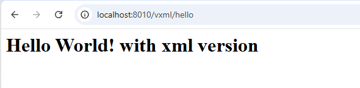
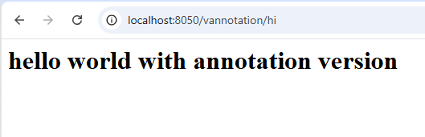

# Servlet Projects

This directory contains servlet tutorials demonstrating two different configuration approaches for Java servlets.

## 📁 Structure

```
servlet/
├── xml_version/              # Web.xml Configuration
├── annotation_version/       # @WebServlet Annotation Configuration
└── README.md                 # This file
```

---

## 📚 Project Descriptions

### 1. xml_version/ - Traditional Configuration

**Overview**: Servlets configured using the `web.xml` deployment descriptor file.

**Key Features**:
- `web.xml` file for servlet declaration and URL mapping
- Traditional approach used in older servlet specifications
- Centralized configuration in XML file
- Complete separation of configuration from code

**Structure**:
```
xml_version/vxml
├── src/main
│   └── java/com/sdia/
│       └── MyServlet.java
├── webapp/
│   └── WEB-INF/
│       └── web.xml
└── README.md
```

**Key Concepts**:
- `<servlet>` tag: Defines servlet class
- `<servlet-mapping>` tag: Maps URL pattern to servlet
- `<url-pattern>` tag: Specifies URL path

**Example **:
```xml
    <servlet>
        <servlet-name> ms </servlet-name>
        <servlet-class> com.sdia.MyServlet </servlet-class>
    </servlet>

    <servlet-mapping>
        <servlet-name> ms </servlet-name>
        <url-pattern> /hello </url-pattern>
    </servlet-mapping>

```
Access at: `http://localhost:8080/app/hello`

---

### 2. annotation_version/ - Modern Annotation-Based Configuration

**Overview**: Servlets configured using Java annotations (`@WebServlet`).

**Key Features**:
- `@WebServlet` annotation on servlet class
- No need for `web.xml` file
- Modern approach (Servlet 3.0+)
- Configuration directly in Java code
- Cleaner and more concise syntax

**Structure**:
```
annotation_version/vannotation
├── src/main
│   └── java/com/sdia/
│       └── MyServlet.java
└── WebContent/
    └── WEB-INF/
        └── web.xml (optional)
```

**Key Concepts**:
- `@WebServlet` annotation: Declares servlet
- `urlPatterns` parameter: Specifies URL paths
- Supports multiple URL patterns

**Example Annotation**:
```java
@WebServlet(name = "msa" , urlPatterns = {"/hello2" , "/hi"})

public class MyServlet extends HttpServlet {
    // Implementation
}
```


---

## 🚀 Running the Projects

### Prerequisites
- Java JDK 
- Apache Tomcat 8
- IDE with servlet support

### Steps

1. **Deploy to Tomcat**
   - Copy project folder to `CATALINA_HOME/webapps/`
   - Or use IDE deployment

2. **Start Tomcat**
   ```bash
   catalina.sh run
   # or on Windows:
   catalina.bat run
   ```

3. **Access Servlet**
   - xml_version: `http://localhost:8080/xml_version/hello`
   - annotation_version: `http://localhost:8080/annotation_version/hello2`

---

## 📖 Learning Concepts

### Common to Both Versions

1. **HttpServlet Class**
   - Extends to create servlets
   - Handles HTTP requests/responses

2. **doGet() Method**
   - Handles HTTP GET requests
   - Parameters: HttpServletRequest, HttpServletResponse

3. **Response Handling**
   - `resp.setContentType("text/html")` - Set response MIME type
   - `resp.getWriter()` - Get PrintWriter for output
   - `out.println()` - Write HTML to response

4. **URL Mapping**
   - Maps HTTP requests to specific servlets
   - Supports exact paths and wildcard patterns

### Example Servlet Code

```java
@WebServlet(name = "msa" , urlPatterns = {"/hello2" , "/hi"})
public class MyServlet extends HttpServlet {

    private String message ;

    public void init(){
        message = "hello world ";
    }

    public void doGet(HttpServletRequest req , HttpServletResponse res) throws ServletException, IOException {

        // Set response type to HTML
        res.setContentType("text/html");

        // Get output stream
        PrintWriter out = res.getWriter();

        // Send HTML response
        out.println("<h1>"+message+" with annotation version </h1>");
    }
}
```

---

## 📸 Screenshots

### XML Version Output


**Description**: Servlet running with web.xml configuration 

### Annotation Version Output


**Description**: Servlet running with @WebServlet annotation configuration